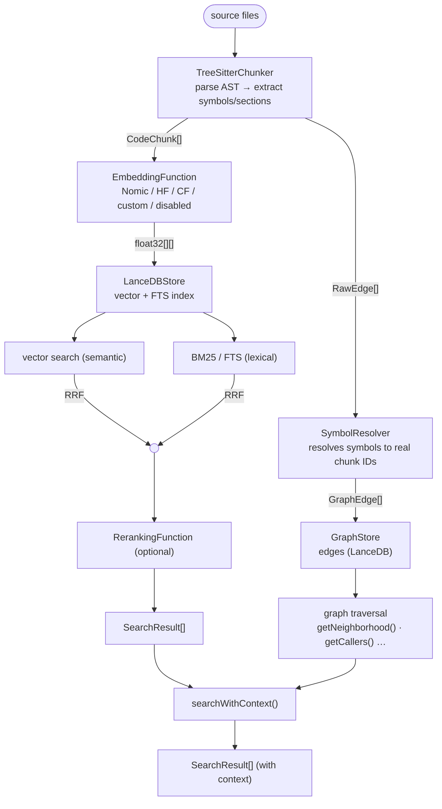

# Lucerna

AST-aware code indexer, search engine, and knowledge graph for AI agents.

Parses your codebase with [tree-sitter](https://tree-sitter.github.io/tree-sitter/) (305 languages), stores structured chunks in an embedded [LanceDB](https://lancedb.com/) database, and exposes hybrid vector + BM25 search with an optional knowledge graph.

---

## Features

- **AST-based chunking** — extracts functions, classes, methods, interfaces, type aliases, and heading sections rather than arbitrary line ranges
- **Hybrid search** — combines semantic (vector) and lexical (BM25 full-text) search via Reciprocal Rank Fusion
- **Optional reranking** — second-stage cross-encoder reranking to improve precision after RRF fusion
- **Knowledge graph** — AST-extracted call, import, and inheritance edges stored in a persisted graph; traverse callers, callees, and dependencies, or expand search results with graph context
- **Repo map** — aider-style concise listing of all indexed files and their top-level symbols
- **Recall evaluation** — built-in `eval` command measures recall@k against a JSONL query set
- **Fully embedded** — uses LanceDB; the index is a directory on disk, one per project
- **Multi-project** — multiple `CodeIndexer` instances in the same process, each fully isolated
- **File watching** — debounced incremental re-indexing via chokidar; watcher path uses an in-memory chunk cache (no full DB scan per file change)
- **Pluggable embeddings** — local (`HFEmbeddings`, `BGESmallEmbeddings`, `NomicCodeEmbeddings`) or remote (`CloudflareEmbeddings`); swap or disable entirely
- **305 languages** — all languages supported by `@kreuzberg/tree-sitter-language-pack` work out of the box with no configuration; Python, Rust, Go, Java, C/C++, Ruby, and more are indexed automatically
- **Gitignore-aware** — `.gitignore` files at any depth are always respected during indexing and watching
- **CLI** — `lucerna index / watch / search / graph / stats / clear / eval`

---

## Installation

### Binary (no runtime required)

**macOS / Linux**

```bash
curl -fsSL https://raw.githubusercontent.com/upstart-gg/lucerna/main/install/install.sh | bash
```

**Windows (PowerShell)**

```powershell
irm https://raw.githubusercontent.com/upstart-gg/lucerna/main/install/install.ps1 | iex
```

Or download a prebuilt binary directly from [GitHub Releases](https://github.com/upstart-gg/lucerna/releases).

### npx / pnpx / bunx (no install needed)

Run the CLI directly without a global install:

```bash
npx @upstart.gg/lucerna index /path/to/project
# or
pnpx @upstart.gg/lucerna search /path/to/project "my query"
# or
bunx @upstart.gg/lucerna index /path/to/project
```

> **Runtime requirement:** Node.js ≥ 20 or Bun ≥ 1.0.

---

## CLI usage

The `lucerna` binary is included. No code required — point it at a directory and go.

### `index` — one-shot indexing

```bash
lucerna index /path/to/project

# Options:
#   --storage-dir <dir>   Override storage directory (default: <root>/.lucerna)
#   --include <globs>     Comma-separated include glob patterns (default: **/*)
#   --exclude <globs>     Additional comma-separated exclude glob patterns
#   --no-semantic         Disable semantic search (BM25 only, skips model download)
```

```
Indexing /path/to/project...
Done. 142 files, 3817 chunks indexed.
```

Set `CLOUDFLARE_ACCOUNT_ID` + `CLOUDFLARE_API_TOKEN` to use Cloudflare embeddings automatically; otherwise a local HuggingFace model is used.

### `watch` — watch and re-index on changes

```bash
lucerna watch /path/to/project

# Same options as index, plus:
#   --debounce <ms>            File-change debounce delay (default: 500)
#
# .gitignore files at any depth are respected automatically.
```

```
Indexing /path/to/project...
Initial index complete. 142 files, 3817 chunks.
Watching for changes. Press Ctrl+C to stop.
[indexed] src/auth/middleware.ts (12 chunks)
[indexed] src/db/pool.ts (8 chunks)
[removed] src/legacy/old-auth.ts
[error]   src/broken.ts: Unexpected token at line 42
```

### `search` — search an existing index

```bash
lucerna search /path/to/project "authentication middleware"

# Options:
#   --no-semantic              Disable semantic search
#   --limit <n>                Max results (default: 10)
#   --format raw|json|pretty-json  Output format (default: raw)
#   --language <lang>              Filter by language: typescript | javascript | json | markdown
#   --type <type>                  Filter by chunk type: function | class | method | interface | …
```

**Raw output (default):**

```
src/auth/middleware.ts:12-45  [function] verifyToken
  export function verifyToken(token: string): JWTPayload {
    const decoded = jwt.verify(token, process.env.JWT_SECRET!);

src/auth/AuthMiddleware.ts:20-35  [method] run  className=AuthMiddleware
  run(req: Request, res: Response, next: NextFunction) {
    const token = req.headers.authorization?.split(' ')[1];

src/auth/guards.ts:8-22  [function] requireAuth
  export function requireAuth(roles: Role[] = []): RequestHandler {

3 result(s)
```

**Compact JSON output (`--format json`)** — single line, ideal for piping:

```bash
lucerna search /path/to/project "verifyToken" --format json | jq '.[0].id'
```

```
[{"id":"a3f9b2c1d4e5f6a7","file":"src/auth/middleware.ts:12-45","type":"function","name":"verifyToken","content":"export function verifyToken..."},...]
```

**Pretty JSON output (`--format pretty-json`)** — indented, for human inspection:

```bash
lucerna search /path/to/project "verifyToken" --format pretty-json
```

```json
[
  {
    "id": "a3f9b2c1d4e5f6a7",
    "file": "src/auth/middleware.ts:12-45",
    "type": "function",
    "name": "verifyToken",
    "content": "export function verifyToken(token: string): JWTPayload {\n  const decoded = jwt.verify(token, process.env.JWT_SECRET!);\n  ..."
  },
  {
    "id": "b7c4d8e2f1a9b3c5",
    "file": "src/auth/AuthMiddleware.ts:20-35",
    "type": "method",
    "name": "run",
    "context": { "className": "AuthMiddleware" },
    "content": "run(req: Request, res: Response, next: NextFunction) {\n  ..."
  }
]
```

### `graph` — explore knowledge graph relationships

```bash
# Get the chunk ID from search output, then traverse the graph
lucerna search /path/to/project "verifyToken" --format json | jq '.[0].id'

lucerna graph /path/to/project <chunk-id> --relation callers
lucerna graph /path/to/project <chunk-id> --relation implementors
lucerna graph /path/to/project <chunk-id> --relation neighborhood --depth 2

# Options:
#   --relation <type>   callers | callees | implementors | super-types | usages | neighborhood (default)
#   --depth <n>         BFS depth for neighborhood (default: 1)
#   --format raw|json|pretty-json  Output format (default: raw)
```

**Callers (raw):**

```
lucerna graph /path/to/project a3f9b2c1d4e5f6a7 --relation callers
```

```
src/auth/AuthMiddleware.ts:20-35  [method] run  (CALLS (incoming))
  run(req: Request, res: Response, next: NextFunction) {
    const payload = verifyToken(token);

src/auth/guards.ts:8-22  [function] requireAuth  (CALLS (incoming))
  export function requireAuth(roles: Role[] = []): RequestHandler {

2 result(s)
```

**Neighborhood (raw):**

```
lucerna graph /path/to/project a3f9b2c1d4e5f6a7 --relation neighborhood --depth 2
```

```
Center: src/auth/middleware.ts:12  [function] verifyToken

src/auth/AuthMiddleware.ts:20-35  [method] run  (CALLS (incoming))
  run(req: Request, res: Response, next: NextFunction) {

src/auth/types.ts:1-8  [interface] JWTPayload  (USES (outgoing))
  export interface JWTPayload { userId: string; roles: Role[]; iat: number; }

2 result(s)
```

### `stats` — show index statistics

```bash
lucerna stats /path/to/project
# --format raw|json|pretty-json
```

```
Project:        /path/to/project
Project ID:     a1b2c3d4e5f6
Total files:    142
Total chunks:   3817
Last indexed:   2025-04-15T10:00:00.000Z
```

**Pretty JSON output (`--format pretty-json`)** includes full breakdowns:

```json
{
  "projectId": "a1b2c3d4e5f6",
  "projectRoot": "/path/to/project",
  "totalFiles": 142,
  "totalChunks": 3817,
  "totalEdges": 1204,
  "byLanguage": {
    "typescript": 3201,
    "javascript": 412,
    "markdown": 156,
    "json": 48
  },
  "byType": {
    "function": 980,
    "method": 1102,
    "class": 87,
    "interface": 243,
    "type": 318,
    "import": 142,
    "section": 156,
    "file": 789
  },
  "byEdgeType": {
    "CALLS": 641,
    "IMPORTS": 312,
    "DEFINES": 142,
    "EXTENDS": 54,
    "IMPLEMENTS": 28,
    "USES": 27
  },
  "lastIndexed": "2025-04-15T10:00:00.000Z"
}
```

### `clear` — delete the index

```bash
lucerna clear /path/to/project
# Removes <project-root>/.lucerna (or --storage-dir)
```

```
Cleared index at /path/to/project/.lucerna
```

### `eval` — measure recall@k

```bash
lucerna eval /path/to/project queries.jsonl --k 1,5,10

# queries.jsonl — one JSON object per line:
#   { "query": "...", "expectedFile": "src/auth.ts", "expectedSymbol": "verifyToken" }
#   (expectedSymbol is optional)

# Options:
#   --k <numbers>       Comma-separated k values to evaluate (default: 1,5,10)
#   --format raw|json|pretty-json  Output format (default: raw)
#   --no-semantic                  Lexical search only
```

```
Evaluation results — 24 queries

  Recall@1  : 54.2%  (13/24)
  Recall@5  : 87.5%  (21/24)
  Recall@10 : 95.8%  (23/24)

Per-query breakdown:
  [@1:✓  @5:✓  @10:✓]  "function that verifies JWT tokens"  →  src/auth/middleware.ts::verifyToken
  [@1:✗  @5:✓  @10:✓]  "database connection pool"  →  src/db/pool.ts
  [@1:✗  @5:✗  @10:✓]  "retry logic with exponential backoff"  →  src/utils/retry.ts::withRetry
  [@1:✓  @5:✓  @10:✓]  "user repository find by email"  →  src/db/UserRepository.ts::findByEmail
```

---

## Programmatic usage

Install as a library dependency:

```bash
pnpm add @upstart.gg/lucerna
# or
npm install @upstart.gg/lucerna
# or
bun add @upstart.gg/lucerna
```

### Quick start

```ts
import { CodeIndexer } from '@upstart.gg/lucerna';

const indexer = new CodeIndexer({
  projectRoot: '/path/to/your/project',
});

await indexer.initialize();   // open DB, init tree-sitter
await indexer.indexProject(); // walk and chunk all matching files

// Hybrid search (semantic + BM25 fused via RRF)
const results = await indexer.search('authentication middleware', { limit: 5 });

for (const r of results) {
  console.log(`${r.chunk.filePath}:${r.chunk.startLine}  [${r.chunk.type}] ${r.chunk.name ?? ''}`);
  console.log(r.chunk.content.slice(0, 200));
}

await indexer.close();
```

### `new CodeIndexer(options)`

```ts
const indexer = new CodeIndexer({
  // --- Required ---
  projectRoot: string,

  // --- Identity ---
  projectId?: string,           // stable ID for namespacing; default: sha1(projectRoot).slice(0,12)

  // --- Storage ---
  storageDir?: string,          // default: <projectRoot>/.lucerna

  // --- File selection ---
  include?: string[],           // default: **/* (all files — language detection filters unknowns)
  exclude?: string[],           // appended to defaults (node_modules, .git, dist, build, …)
                                // .gitignore at any depth is always applied automatically

  // --- Embeddings (see Embeddings section) ---
  embeddingFunction?:
    | EmbeddingFunction         // custom instance
    | false,                    // disable semantic search, BM25 only
                                // undefined → auto: CloudflareEmbeddings if env vars set, else NomicCodeEmbeddings

  // --- Reranking (see Reranking section) ---
  rerankingFunction?:
    | RerankingFunction         // custom instance
    | false,                    // default: false (no reranking)


  // --- Chunking ---
  maxChunkTokens?: number,      // soft max tokens per chunk (1 token ≈ 4 chars); default: 1500

  // --- Watching ---
  watch?: boolean,              // start watching on initialize(); default: false
  watchDebounce?: number,       // debounce delay in ms; default: 500

  // --- Callbacks ---
  onIndexed?: (event: IndexEvent) => void,
  // IndexEvent: { type: 'indexed' | 'removed' | 'error', filePath, chunksAffected?, error? }
});
```

### Lifecycle

```ts
await indexer.initialize();  // required before any other method; idempotent
await indexer.close();       // flushes pending writes, closes DB, stops watcher
```

### Indexing

```ts
const stats: IndexStats = await indexer.indexProject();
// {
//   projectId, projectRoot,
//   totalFiles, totalChunks, totalEdges,
//   byLanguage,  // e.g. { typescript: 120, markdown: 12 }
//   byType,      // e.g. { function: 80, class: 15, method: 90, … }
//   byEdgeType,  // e.g. { CALLS: 200, IMPORTS: 150, … }
//   lastIndexed,
// }

await indexer.indexFile('src/utils.ts');  // (re-)index a single file
await indexer.removeFile('src/utils.ts'); // remove a file's chunks and edges
```

> `indexProject()` throws if called while a previous call is still in progress.

### Searching

```ts
// Hybrid search (default: semantic + BM25 via RRF)
const results = await indexer.search(query, options?);

// Semantic only
const results = await indexer.searchSemantic(query, options?);

// Lexical / BM25 only
const results = await indexer.searchLexical(query, options?);

// Hybrid + graph-context expansion
const results = await indexer.searchWithContext(query, options?);
```

**`SearchOptions`:**

```ts
{
  limit?: number,                          // default: 10
  language?: Language | Language[],        // filter by language
  types?: ChunkType[],                     // filter by chunk type
  filePath?: string,                       // path filter (glob patterns supported)
  hybrid?: boolean,                        // default: true when embeddings available
  minScore?: number,                       // minimum score threshold (0–1)
  rerank?: boolean,                        // apply reranking after RRF; default: true when rerankingFunction set
  rrfK?: number,                           // RRF rank constant k; default: 45 (tuned for code retrieval)
}
```

**`SearchWithContextOptions`** (extends `SearchOptions`):

```ts
{
  graphDepth?: number,                     // BFS hops to expand — default: 1
  graphRelationTypes?: RelationshipType[], // edge types to follow — default: all
  contextScoreDiscount?: number,           // score multiplier for neighbour chunks — default: 0.7
}
```

**`SearchResult`:**

```ts
{
  chunk: CodeChunk,
  score: number,                           // higher = more relevant
  matchType: 'semantic' | 'lexical' | 'hybrid',
}
```

### Repo map

```ts
// Aider-style concise listing of indexed files + their top-level symbols
const map = await indexer.getRepoMap({
  maxFiles?: number,    // cap by file count (largest-symbol-count first)
  types?: ChunkType[],  // default: function, class, interface, type, enum
  format?: 'text' | 'json',  // default: 'text'
});

// Text format example:
// src/search/Searcher.ts
//   class Searcher (18-112)
//   function reciprocalRankFusion (118-150)
```

### Graph traversal

```ts
// BFS neighbourhood — center chunk + reachable neighbours within depth hops
const neighborhood: GraphNeighborhood = await indexer.getNeighborhood(chunkId, {
  depth?: number,                          // default: 1
  relationTypes?: RelationshipType[],      // default: all
  limit?: number,                          // max neighbours; default: 20
});

// Call graph
const callers: CodeChunk[] = await indexer.getCallers(chunkId);
const callees: CodeChunk[] = await indexer.getCallees(chunkId);

// Import graph
const deps: CodeChunk[]       = await indexer.getDependencies('src/auth.ts');
const dependents: CodeChunk[] = await indexer.getDependents('src/auth.ts');

// Inheritance
const implementors: CodeChunk[] = await indexer.getImplementors(chunkId);
const superTypes:   CodeChunk[] = await indexer.getSuperTypes(chunkId);

// Raw edge access
const outgoing: GraphEdge[] = await indexer.getEdgesFrom(chunkId, types?);
const incoming: GraphEdge[] = await indexer.getEdgesTo(chunkId, types?);
```

### File watching

```ts
await indexer.startWatching();
await indexer.stopWatching();
// or pass watch: true to the constructor — starts automatically on initialize()
```

### Inspection

```ts
const stats  = await indexer.getStats();
const files  = await indexer.listFiles();    // relative paths of all indexed files
const chunks = await indexer.getChunks('src/utils.ts');
```

---

## Embeddings

### Auto-detection (default)

When `embeddingFunction` is not set, the indexer auto-selects:

1. **`CloudflareEmbeddings`** — if `CLOUDFLARE_ACCOUNT_ID` and `CLOUDFLARE_API_TOKEN` are set in the environment
2. **`NomicCodeEmbeddings`** — otherwise, runs a local code-optimised model via ONNX (no API key required)

### Local models

```ts
import { CodeIndexer, BGESmallEmbeddings, HFEmbeddings, NomicCodeEmbeddings } from '@upstart.gg/lucerna';

// Code-optimised local model (default when no Cloudflare env vars)
const indexer = new CodeIndexer({
  projectRoot: '.',
  embeddingFunction: new NomicCodeEmbeddings(),
});

// General-purpose — Xenova/bge-small-en-v1.5 (MTEB 62.17)
const indexer = new CodeIndexer({
  projectRoot: '.',
  embeddingFunction: new BGESmallEmbeddings(),
});

// Any ONNX model from the Hub
const indexer = new CodeIndexer({
  projectRoot: '.',
  embeddingFunction: new HFEmbeddings(
    'Xenova/bge-small-en-v1.5', // modelId
    384,                         // dimensions — must match model output
    'fp32',                      // dtype: 'auto' | 'fp32' | 'fp16' | 'q8' | 'q4' | …
  ),
});
```

All local models run via `@huggingface/transformers` + ONNX. Models are downloaded from Hugging Face Hub on first use and cached.

### Remote — `CloudflareEmbeddings`

Uses Cloudflare Workers AI (`@cf/baai/bge-m3`, 1024 dimensions). Requires a Cloudflare account with Workers AI enabled.

```ts
import { CodeIndexer, CloudflareEmbeddings } from '@upstart.gg/lucerna';

const indexer = new CodeIndexer({
  projectRoot: '.',
  embeddingFunction: new CloudflareEmbeddings(
    process.env.CLOUDFLARE_ACCOUNT_ID,
    process.env.CLOUDFLARE_API_TOKEN,
  ),
});
```

Or set environment variables and let auto-detection handle it:

```bash
export CLOUDFLARE_ACCOUNT_ID=your-account-id
export CLOUDFLARE_API_TOKEN=your-api-token
lucerna index .
```

**Key properties:**
- Model: `@cf/baai/bge-m3` — multilingual, 1024 dimensions
- Oversized texts are split and averaged rather than truncated
- Automatic batching and retry logic (3 retries, 30 s timeout)

### Disable semantic search (BM25 only)

```ts
const indexer = new CodeIndexer({
  projectRoot: '.',
  embeddingFunction: false,  // no model, no API key, BM25 search only
});
```

### Custom embedding function

```ts
import type { EmbeddingFunction } from '@upstart.gg/lucerna';

class OpenAIEmbeddings implements EmbeddingFunction {
  readonly dimensions = 1536;
  readonly modelId = 'text-embedding-3-small';

  async generate(texts: string[]): Promise<number[][]> {
    const response = await openai.embeddings.create({
      model: this.modelId,
      input: texts,
    });
    return response.data.map(d => d.embedding);
  }
}

const indexer = new CodeIndexer({
  projectRoot: '.',
  embeddingFunction: new OpenAIEmbeddings(),
});
```

---

## Reranking

After RRF fusion, a cross-encoder reranker scores each candidate against the query and re-sorts results by relevance. This improves precision at the cost of an additional inference pass.

### `CloudflareReranker`

Uses Cloudflare Workers AI (`@cf/baai/bge-reranker-base`, 512-token cross-encoder).

```ts
import { CodeIndexer, CloudflareEmbeddings, CloudflareReranker } from '@upstart.gg/lucerna';

const indexer = new CodeIndexer({
  projectRoot: '.',
  embeddingFunction: new CloudflareEmbeddings(),
  rerankingFunction: new CloudflareReranker(),
});
```

Reranking is applied automatically in `search()` and `searchWithContext()` when a `rerankingFunction` is configured. Opt out per-query with `{ rerank: false }`.

### Other rerankers

`JinaReranker` and `VoyageReranker` are also provided and follow the same interface. Bring your own by implementing `RerankingFunction`:

```ts
import type { RerankingFunction } from '@upstart.gg/lucerna';

class MyReranker implements RerankingFunction {
  async rerank(query: string, texts: string[]): Promise<number[]> {
    // return a relevance score (0–1) for each text in the same order
  }
}
```

---

## Core concepts

### CodeChunk

The atomic unit of the index. Every chunk has:

| Field | Description |
|---|---|
| `id` | Stable 16-char hex hash of `projectId + filePath + startLine` |
| `projectId` | Isolates chunks belonging to this project |
| `filePath` | Path relative to `projectRoot` |
| `language` | Any language supported by `@kreuzberg/tree-sitter-language-pack` (e.g. `typescript`, `python`, `rust`, `go`, …) |
| `type` | See **Chunk types** below |
| `name` | Symbol name (function/class/method/heading), if applicable |
| `content` | Raw source text |
| `contextContent` | Embedding input: `content` prefixed with breadcrumb, file imports, and (for methods) the class header |
| `startLine` / `endLine` | 1-based line range in the original file |
| `metadata` | Extra data, e.g. `{ className: "UserService", breadcrumb: "// Class: UserService" }` on method chunks |

### Chunk types

| Type | Produced from |
|---|---|
| `function` | Function declarations, generator functions, arrow functions, Rust/Go/Python/Bash functions |
| `class` | Class declarations; also Rust `struct` and `impl` blocks, Ruby/Python `module` |
| `method` | Individual methods inside a class (Java, C#, PHP, Go receiver methods, …) |
| `interface` | TypeScript `interface`; also Rust `trait`, Swift `protocol` |
| `type` | TypeScript `type` alias; also Rust/Java/Kotlin `enum` |
| `variable` | Variable declarations |
| `import` | All import statements in a file, grouped as one chunk |
| `section` | Markdown heading section (H1–H3) |
| `file` | Whole-file fallback for small or structureless files (e.g. SQL) |

### Search modes

| Mode | When used |
|---|---|
| **Hybrid** (default) | Embedding function available — runs vector search and BM25, fuses via RRF |
| **Semantic only** | `searchSemantic()` |
| **Lexical only** | `searchLexical()` or `embeddingFunction: false` |
| **Graph-context** | `searchWithContext()` — hybrid search + BFS graph expansion |

### Knowledge graph

The indexer extracts a directed relationship graph from the AST alongside chunks.

**`RelationshipType`:**

| Type | Meaning |
|---|---|
| `CALLS` | A function/method calls another function/method |
| `IMPORTS` | A file's import block references another module |
| `DEFINES` | The import chunk maps to each named declaration in the file |
| `EXTENDS` | A class extends another class |
| `IMPLEMENTS` | A class implements an interface |
| `USES` | A chunk references a type or variable defined elsewhere |

---

## Language support

All 305 languages supported by [`@kreuzberg/tree-sitter-language-pack`](https://github.com/Kreuzberg/tree-sitter-language-pack) are indexed automatically — no configuration required. Point lucerna at a Python, Rust, Go, or any other project and it just works.

**Default include pattern is `**/*`** — language detection filters out files with no recognized extension, so unknown or binary file types produce no chunks.

**`.gitignore` is always respected.** Lucerna discovers all `.gitignore` files in the project tree (root and subdirectories) and applies their patterns to both indexing and file watching.

### Chunking quality per language

| Language | Extraction |
|---|---|
| TypeScript, JavaScript (TSX/JSX) | Full: imports, functions, generator functions, arrow functions, classes, methods, interfaces, type aliases |
| JSON | Top-level key splitting for large files; single chunk for small files |
| Markdown | Heading-based sections (H1–H3) with full breadcrumbs |
| Python, Java, PHP, C#, Swift, Bash, and others | Structure extraction via tree-sitter (functions, classes, methods); falls back to whole-file chunk if the grammar yields no structure |
| Rust | Functions, structs (`class`), impl blocks (`class`), traits (`interface`), enums (`type`) |
| Go | Functions and receiver methods |
| SQL | Whole-file chunk (no structure extraction) |

### Lazy grammar loading

Grammar modules are loaded on first encounter — no configuration needed. Lucerna automatically initializes any language the first time it sees a file of that type.

---

## Multiple projects in one process

Each `CodeIndexer` instance is fully isolated — separate database, separate watcher:

```ts
const [frontend, backend] = await Promise.all([
  (async () => {
    const idx = new CodeIndexer({ projectRoot: '/repos/frontend' });
    await idx.initialize();
    await idx.indexProject();
    return idx;
  })(),
  (async () => {
    const idx = new CodeIndexer({ projectRoot: '/repos/backend' });
    await idx.initialize();
    await idx.indexProject();
    return idx;
  })(),
]);

const frontendResults = await frontend.search('React component');
const backendResults  = await backend.search('authentication handler');
```

---

## Wrapping for AI agent tools

### Vercel AI SDK

```ts
import { tool } from 'ai';
import { z } from 'zod';
import { CodeIndexer } from '@upstart.gg/lucerna';

const indexer = new CodeIndexer({ projectRoot: process.cwd() });
await indexer.initialize();
await indexer.indexProject();

export const searchCodeTool = tool({
  description:
    'Search the codebase for relevant functions, classes, methods, or documentation. ' +
    'Use natural language or symbol names.',
  parameters: z.object({
    query: z.string().describe('Natural language or symbol name'),
    limit: z.number().int().min(1).max(20).default(5),
    language: z.enum(['typescript', 'javascript', 'json', 'markdown']).optional(),
  }),
  execute: async ({ query, limit, language }) => {
    const results = await indexer.search(query, { limit, language });
    return results.map(r => ({
      file:    r.chunk.filePath,
      type:    r.chunk.type,
      name:    r.chunk.name ?? null,
      lines:   `${r.chunk.startLine}–${r.chunk.endLine}`,
      content: r.chunk.content,
      score:   r.score,
    }));
  },
});
```

### Anthropic / Claude tool use

```ts
import Anthropic from '@anthropic-ai/sdk';
import { CodeIndexer } from '@upstart.gg/lucerna';

const indexer = new CodeIndexer({ projectRoot: process.cwd() });
await indexer.initialize();
await indexer.indexProject();

const tools: Anthropic.Tool[] = [{
  name: 'search_code',
  description: 'Search the codebase for relevant code or documentation.',
  input_schema: {
    type: 'object',
    properties: {
      query: { type: 'string', description: 'Search query' },
      limit: { type: 'number', description: 'Max results', default: 5 },
    },
    required: ['query'],
  },
}];

async function handleToolCall(name: string, input: Record<string, unknown>) {
  if (name === 'search_code') {
    const results = await indexer.search(input.query as string, {
      limit: (input.limit as number) ?? 5,
    });
    return results.map(r => ({
      file:    r.chunk.filePath,
      type:    r.chunk.type,
      name:    r.chunk.name,
      lines:   `${r.chunk.startLine}–${r.chunk.endLine}`,
      content: r.chunk.content,
    }));
  }
}
```

---

## How it works



**Chunking strategy:**
- **TS/JS/TSX/JSX** — tree-sitter queries extract imports, functions, generator functions, arrow functions, classes, methods, interfaces, and type aliases. Each chunk's `contextContent` prepends a breadcrumb, the import block, and (for methods) the class header for better embedding signal. Adjacent tiny chunks (below `minChunkTokens`) are merged to avoid low-quality micro-embeddings.
- **JSON** — files with ≤3 top-level keys or under the size threshold: single chunk. Larger files: one chunk per top-level key.
- **Markdown** — split at H1/H2/H3 headings; each section carries its full breadcrumb (`# Guide > ## Setup > ### Config`).
- **Other languages (305 total)** — grammar loaded lazily on first encounter; structure extraction (functions, classes, methods) where the grammar supports it, whole-file fallback otherwise. `.gitignore` at any depth is always applied.

**Hybrid search:**
Both vector search (top-K by cosine similarity) and BM25 (top-K by text relevance) run in parallel. Results are merged with [Reciprocal Rank Fusion](https://plg.uwaterloo.ca/~gvcormac/cormacksigir09-rrf.pdf) (`score = Σ 1 / (k + rank)`, default `k=45` tuned for code retrieval), then optionally re-ranked by a cross-encoder.

**Code-aware BM25:**
Identifiers are expanded before indexing — `getUserById` becomes `getUserById get user by id`, `parse_json` becomes `parse_json parse json` — so BM25 matches sub-word tokens without sacrificing exact-identifier recall.

---

## Development

```bash
pnpm install      # install deps
pnpm build        # bundle with tsdown → dist/
bun test          # run unit test suite
bun run typecheck # tsgo --noEmit
bun run lint      # biome check --write
```

---

## License

MIT
