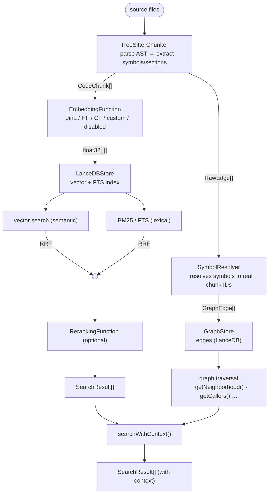
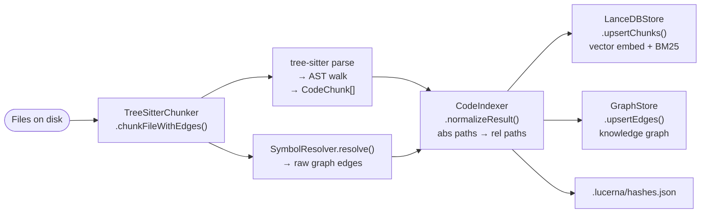
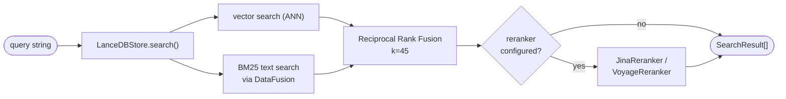

## Architecture

## Indexing data flow

## Search data flow

## Chunking strategy

- **TS/JS/TSX/JSX** — tree-sitter queries extract imports, functions, generator functions, arrow functions, classes, methods, interfaces, and type aliases. Each chunk's `contextContent` prepends a breadcrumb, the import block, and (for methods) the class header for better embedding signal. Adjacent tiny chunks (below `minChunkTokens`) are merged to avoid low-quality micro-embeddings.
- **JSON** — files with ≤3 top-level keys or under the size threshold: single chunk. Larger files: one chunk per top-level key.
- **Markdown** — split at H1/H2/H3 headings; each section carries its full breadcrumb (`# Guide > ## Setup > ### Config`).
- **Other languages (305 total)** — grammar loaded lazily on first encounter; structure extraction (functions, classes, methods) where the grammar supports it, whole-file fallback otherwise.
